## dsi-p6-win311-alu0100658705

## Pablo Bethencourt Díaz

## alu0100658705@ull.edu.es

### Práctica 6 Windows 3.11

1. **Crea la estructura de carpetas (scaffolding) utilizando el CLI de Vue (@vue/cli).**

Para empezar debemos realizar una instalación global mediante el comando <code> npm install -g @vue/cli </code>, una vez se halla instalado ejecutamos <code> vue create vue-sample </code> para crear el proyecto de la práctica:

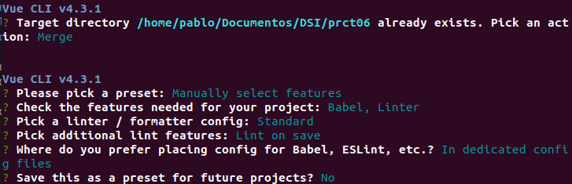

Observas la estructura de carpetas generada automaticamente:

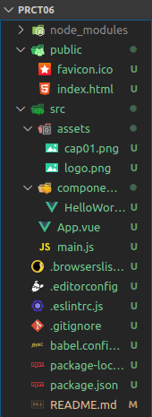

2. **El componente principal contendrá el fondo de pantalla 2 ventanas y un icono.**

Vemamos la estructura del componente principal _App.vue_:

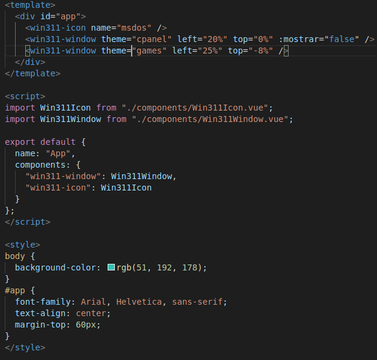

- Se han definido dos componentes _Win311Window_: cpanel y games.
- Un componente _icono_ con el icono del ejemplo.
- Para los estilos se ha definido el color de fondo y algunos estilos adicionales no muy significativos.

3. **El componente Win311Window debe contener toda la estructura de la ventana y tendrá una zona donde aparecerán los iconos, que son nuestro otro componente: Win311Icon, que muestra el icono y el nombre.**

Dentro del componenete **Win311Window** se ha definido la siguiente estructura. Para empezar dentro de _template_ tenemos:

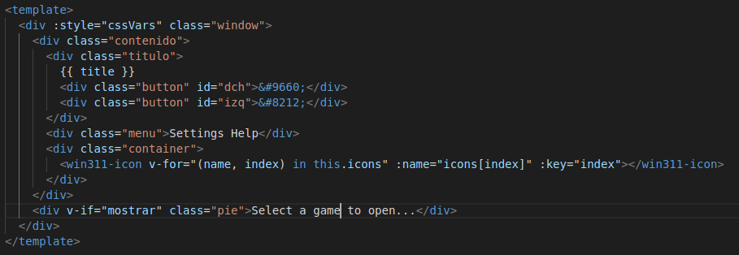

- Se ha añadido una directiva _style_ que hace referencia a un método definido como una propiedad computada _cssVars()_ que se encarga de definir parametros de estilos diferentes para cada uno de los componentes ventana en función de los _props_ recibidos. En este caso se está utilizando para que una ventana se sobreponga ligeramente a la otra.

- Se añade el título de la ventana a la barra del menú a través de la variable definida en data; _title_.

- Se añade el menú y las etiquetas correspondientes que lo conforman.

- Para generar los componentes de icono que conformarán la ventana se utiliza la siguiente etiqueta <code><win311-icon v-for="(name, index) in this.icons" :name="icons[index]" :key="index"></win311-icon></code>; se aplica un bucle sobre la variable _icons_ del componente _Win311Window_ que contiene un array con el nombre de los iconos que se han importado previamente del fichero _windows.json_.

- Por último en <code>
Select a game to open...
</code> se utiliza una condición extraida de una _prop_ que recibe el componente, esta define si se debe o no mostrar dicho componente (La utilizamos para que no se vea en la ventana que se encuentra debajo).

Dentro de _script_ se ha trabajo de la siguiente forma:

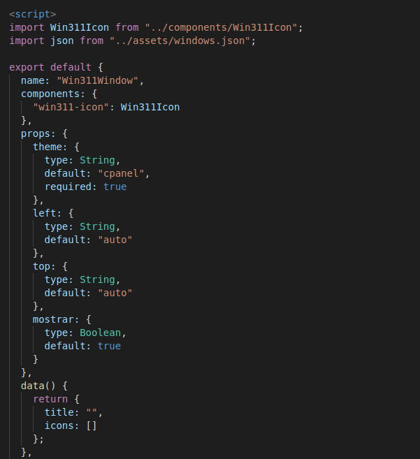

- Se importa el fichero json y el componente _Win311Icon_.

- Definición de todos los _props_ y de las variables del componente.

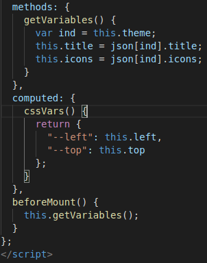

- Se crea un método _getVariables()_ que lee los datos del fichero json, y en función del valor de la propiedad _theme_ se definen las variables.

- Para cargar el método anterior se hace uso del método de "livecycle" _beforeMount()_ que definirá el valor de las variables justo después de inicializar la instancia del componente.

Por último se han definido los estilos, en el caso del elemento _window_ se aplican las variables definidas anteriormente:

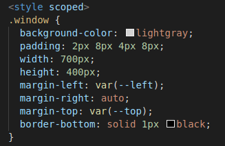

4. **En el archivo icons.zip tienes una colección de iconos de Windows 3.11 que puedes utilizar para colocar en tu práctica. Recuerda meterlos en la carpeta assets.**

Se han añadido los iconos:

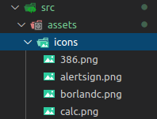

5. **Las ventanas tendrán una prop type que dará a conocer en el interior del componente, de que ventana se trata (Control Panel, Apps, Games...) y que iconos tiene asociados. La ventana deben mostrar obligatoriamente, al menos, un título y una colección de iconos.**

Como se puede observar, se cumple lo establecido en el enunciado. Se ha definido la _prop_ como _theme_ en vez de _type_ puesto que se emplea el formato largo a la hora de definirlas y se evita confusiones con el elemento _type_.

6. **Los iconos por su parte, recibirán una prop name que indicará el icono del que se trata.**

Veamos el contenido del componente _Win311Icon_:

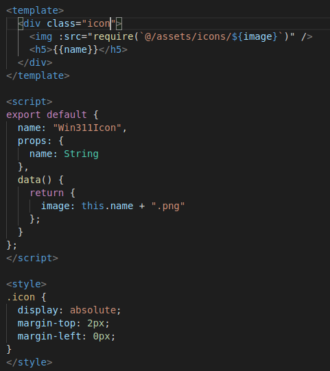

7. **En esta ocasión pasamos a utilizar el cli de Vue, el cuál no utiliza Parcel por debajo, sino Webpack, por lo que algunas cosas cambiarán. Investiga como hacer el despliegue a GitHub Pages, de forma similar a como lo hacíamos con Parcel. Recuerda que debes cambiar la URL al desplegar en GitHub Pages, similar a como lo hacíamos con el parámetro --public-url y la carpeta build. Documéntalo en el README.**

En primer lugar se define un fichero _vue.config.js_ con el siguiente contenido:

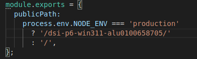

A continuación debemos se ejcuta el comando <code>npm run build</code>:

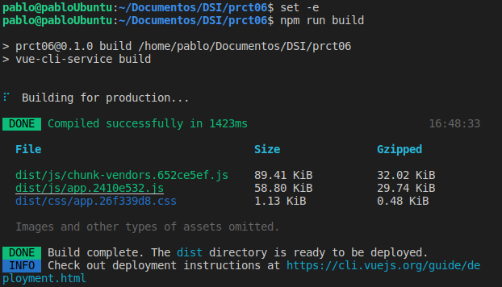

Nos creará la carpeta _dist_, tendremos que entrar a ella, crear una nueva rama _gh-pages_ y volcar el contenido en el repositorio desde la nueva rama.

### Retos

3. **Al hacer doble click sobre un icono, debe mostrar un alert() indicando el nombre icono que se ha seleccionado.**

Para ello se hace uso de la directiva _v-on_ con el evento _dblclick_ que llamaría al método _mensaje_. Veamos la implemenatción:

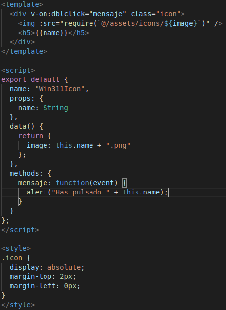

1. **Interesaria que cada vez que el usuario pulse en el icono de una ventana, se resalte el fondo del texto para indicar que ese icono está seleccionado.**

La implementación realizada ha sido similar al anterior reto; una directiva _v_on_ con el evento _click_ que llama a un método que añade o elimina el color de fondo del texto:

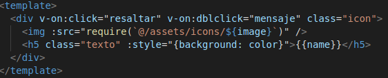

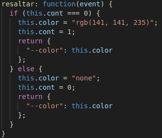

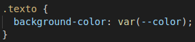
